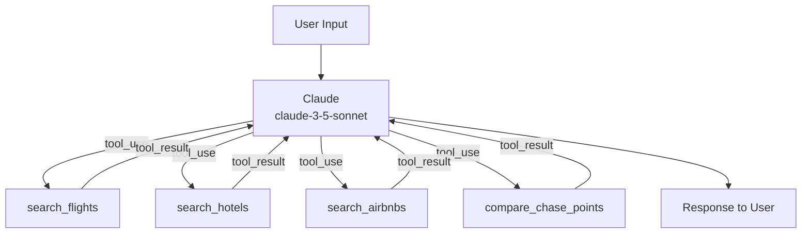

# AI Japan Travel Agent

A Python-based AI travel agent that plans a full 2-week Japan trip — searching real flight and hotel prices, finding Airbnbs, and calculating whether Chase Sapphire Preferred points give better value than paying cash.

Powered by Claude (Anthropic) as the reasoning engine, with live data from Amadeus, RapidAPI Hotels, and Apify.

## What It Does

- **Flight search** — queries Amadeus for real round-trip fares with airline, stops, duration, and price
- **Hotel search** — finds hotels in any Japanese city sorted by price via RapidAPI Hotels4
- **Airbnb search** — scrapes live Airbnb listings for a given neighborhood via Apify
- **Chase points optimizer** — after every price result, calculates points needed via Chase Travel Portal vs. transferring to airline/hotel partners (ANA, JAL, Hyatt) and recommends the best redemption
- **Full itinerary** — builds a day-by-day 2-week Japan itinerary around your actual bookings and interests

The agent runs as an interactive CLI conversation. It asks for your departure city, travel dates, Chase points balance, budget, and interests — then does all the searching autonomously using Claude's tool-use API.

## Setup

**1. Install dependencies**
```bash
pip install anthropic requests apify-client
```

**2. Configure API keys**

Copy `.env.example` to `.env` and fill in your keys:
```bash
cp .env.example .env
```

| Key | Where to get it |
|-----|----------------|
| `ANTHROPIC_API_KEY` | [console.anthropic.com](https://console.anthropic.com) |
| `AMADEUS_CLIENT_ID` / `AMADEUS_CLIENT_SECRET` | [developers.amadeus.com](https://developers.amadeus.com) — free test account |
| `RAPIDAPI_KEY` | [rapidapi.com](https://rapidapi.com) — subscribe to Hotels4 |
| `APIFY_TOKEN` | [apify.com](https://apify.com) — free tier available |

**3. Run**
```bash
python agent.py
```

## Example Session

```
You: I want to fly from LA in late March, 2 weeks, I have 80,000 Chase points
Kenji: I found 3 flights from LAX → NRT...
       Cheapest: $850 on ANA (1 stop, 12h 45m)
       With your 80,000 points via Chase Portal (1.25 cpp): ~64,000 pts
       Or transfer to ANA Miles: 55,000 pts for economy roundtrip (~$900 value)
       → Recommendation: Transfer to ANA Miles for best value...
```

## Architecture

The agent uses Claude's tool-use API in a loop — Claude decides when to call each tool, interprets results, and generates responses. Each turn allows up to 8 tool calls before forcing a response to prevent runaway loops.



## Notes

- Amadeus free tier uses test/sandbox data — prices are realistic but not live
- Airbnb results depend on Apify actor availability
- Chase point values are estimates; always verify award space before transferring points
